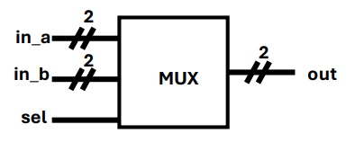

# Exercise #1 (08/10/2024)

**Guilherme de Oliveira Silva**

1. **Comment the differences between simulation and formal verification. Consider the following:**
    - **Design and complexity**
    - **Computational expense**
    - **Validation coverage**
    - **Team effort**

Simulation and formal verification are tools to test chip designs. While both aim to validate the behavior of a design, their approaches are different. 

Simulation takes a list of behaviors to test, and it checks if design works as expected. This list of behaviors, however, might not comprehend all the possible states and some bugs might not be hit – and thus go undetected. Formal verification, on the other hand, models the entire design as set of constraints and exhaustively checks if all the possible states work as intended.

This difference causes formal verification to become very computationally expensive as the design gets more complex: the number of possible states in the search space grows exponentially, and there might not be enough time to walk through it – which might lead to inconclusive results. Because of this, this technique is more suited to test smaller designs; larger, more complex designs are usually tested through simulation.

The required team effort also varies based on the selected approach. For simulation, the effort goes to develop and maintain meaningful testbenches, and to analyze the results the simulation reports. Formal verification, on the other hand, requires the team to correctly model the properties of the design in such manner that it captures the behaviors and properties of interest – the testing itself is mostly automated.

1. **Write the truth table for the following component, `in_a` is `active_low`.**
    - **Consider using “don't care” (X).**



The truth table of this Multiplexer is as expressed below:

| `sel` | `in_a` | `in_b` | `out` |
| --- | --- | --- | --- |
| 0 | 00 | X | 11 |
| 0 | 01 | X | 10 |
| 0 | 10 | X | 01 |
| 0 | 11 | X | 00 |
| 1 | X | 00 | 00 |
| 1 | X | 01 | 01 |
| 1 | X | 10 | 10 |
| 1 | X | 11 | 11 |

1. **Simplify the following boolean algebra expression. It is the carry logic of a full-adder.**

```verilog
c_out = ((a[1] & b[1]) | (a[1] & carry) | (b[1] & carry))
```

This expression is equivalent to

```verilog
c_out = ((a[1] & b[1]) | ((a[1] | b[1]) & carry));
```

If we apply the distributive law.

1. **Draw the FSM diagram of the following table. What is the circuit doing?**


This circuit implements a simple 3-bit binary counter. It has a `rst` signal, that makes any state go to `000`, and a `up` signal, that goes to a state that represents the next number. After reaching `111` – the maximum number that can be represented with 3 bits –, it loops in the same state.


`rst = 0` was omitted for clarity.