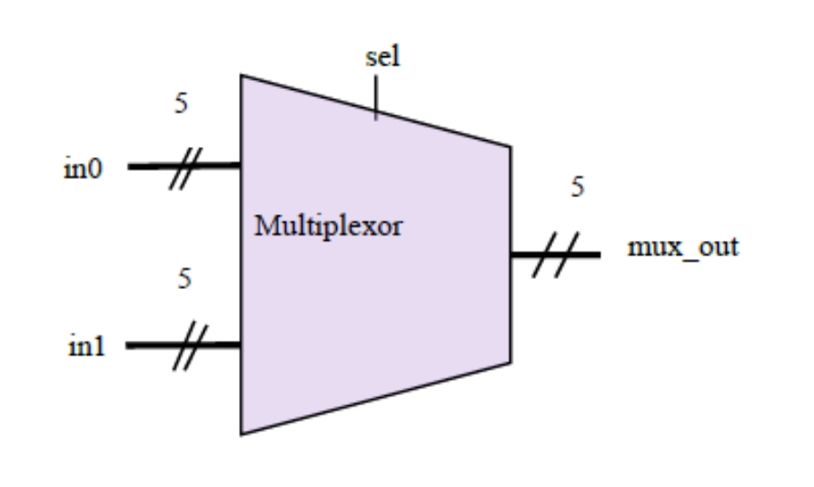

# Exercise #2 (15/10/2024)

**Guilherme de Oliveira Silva**

1. **Write a Verilog module implementation of the multiplexer below:**



```verilog
module multiplexor(
	input in0[4:0], in1[4:0], sel,
	output mux_out[4:0]
);
	always @(in0 or in1 or sel)
		begin
			if (sel == 0)
				mux_out = in0;
			else
				mux_out = in1;
		end
	
endmodule
```

1. **Code this two input AND operation using two different implementations:**


- **Wires for inputs and output**

```verilog
module wires_in_wires_out(
	input wire a,
	input wire b,
	
	output wire y
);

	assign y = a & b;

endmodule
```

- **Wires for inputs, and reg for output**

```verilog
module wires_in_reg_out(
	input wire a,
	input wire b,
	
	output reg y
);

	always @(a and b)
		begin
			y = a & b;
		end

endmodule
```

1. **What is the primary difference between a net and a variable?**

Nets represent physical connection between structures – i.e., wires –, and cannot store values by itself. Variables, on the other hand, are abstractions to hold values, and are similar to memory representations.

It is worth noting that variables can be synthesized to wires, registers or not be synthesizable at all.

1. **Code the following logic using a procedural block:**


```verilog
module q4(
	input wire a,
	input wire b,
	input wire c,
	input wire ctrl,
	input wire [3:0] f,
	
	output reg d
);

	always @(a or b or c)
		begin
			wire _and = a & b;
			
			if (f < 4'b0110)
				begin
					d = _and;
				end
			else
				begin
					if (ctrl == 0)
						begin
							d = c;
						end
					else
						begin
							d = 0;
						end
					end
				end
			end

endmodule
```

1. **What are the values of A and B at checkpoint 1? And at checkpoint 2?**


At checkpoint 1, `A = 4` and `B = 5`. This is due to the fact that this part uses blocking assignments. Thus, the assignment of `B = A + 1` is evaluated only after `A = A + 1`. Considering that `A` is initially `3`, the code will sequentially assign `4` to `A`, and `5` to `B`.

Right after checkpoint 1, the code once again *blockingly* assigns `3` to `A`. Then, it uses two non-blocking assignments to set both `A` and `B` to `A + 1`. As non-blocking assignments are executed in parallel, both `A` and `B` will be equal to `4` at checkpoint 2.

1. **The procedural Verilog code below is synthesizable but generates 8 adders. If we want to
reduce the cost of the synthesized circuit, rewrite the code so it uses only 2 adders.
Note that the original circuit does the operation on a single clock cycle. This optimization
requires that we accumulate the values through different clock cycles. After how many
clock cycles will the final value of q be available?**


```verilog
module sum # (
 parameter WIDTH = 8
) (
 input clk, rstn,
 input [WIDTH-1:0] a,
 output reg [WIDTH-1:0] q
);

integer idx = 0;
reg [WIDTH-1:0] accumulator;

	always @(posedge clk, negedge rstn)
		begin
			if (~rstn)
				begin
					q = 0;
					idx = 0;
					aux = 0;
				end
			else
				begin
					if (idx < WIDTH)
						begin
							accumulator = accumulator + a[idx] + a[idx + 1];
							idx = idx + 2;
						end
					else
						begin
							q = accumulator;
							idx = 0;
						end
				end
			end
		end

endmodule
```