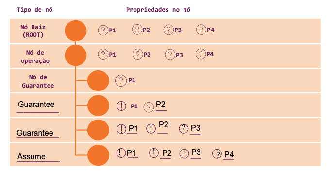

# Lab #4 (17/12/2024)

**Guilherme de Oliveira Silva**

1. **Ao se aplicar a técnica de Case Splitting, o que deve ser verificado para garantir que não haja overconstraining (“restrição”) do espaço de estados?**

Ao se utilizar a técnica de Case Splitting, é fundamental garantir que casos não triviais – em
particular, casos críticos – não sejam eliminados da verificação, pois isso permite que erros de
design não sejam devidamente capturados.

Esse tipo de restrição excessiva do espaço de estados considerado pode ser introduzida por uma série
de más práticas. Em primeiro lugar, deve-se verificar se todos os casos factíveis são considerados
pelo solucionador durante a prova. Além disso, também deve-se avaliar se os casos gerados pelo
*splitting* são mutuamente exclusivos. A sobreposição e/ou intersecção entre casos distintos pode
gerar restrições excessivas que eliminam casos válidos. Finalmente, restrições muito específicas
devem ser evitadas. Deve-se, em partes, delegar à ferramenta o critério de eliminação de casos
ao se analisar um design parcialmente.

Boas práticas podem ser empregadas para se evitar os problemas anteriormente discutidos. É possível
diagnosticar restrições excessivas ao se testar a equivalência entre o design inicial e a combinação
de designs parciais (isto é, o conjunto de casos gerados pelo *splitting*). Além disso, idealmente,
as restrições devem ser adicionadas gradualmente.

2. **Qual o efeito de uma assumption em um espaço de estados?**

Assumptions servem para reduzir o espaço de estados a ser testado durante a verificação de um
design. Através destas, é possível informar ao sistema de verificação que partes do design serão
sempre válidos ou seguirão alguma propriedade de interesse. Com isto, pode-se direcionar esforços
para se verificar somente os componentes mais críticos de um design. Em particular, pode-se eliminar
casos triviais ou impossíveis de um sistema.

Por exemplo, considere a verificação de uma ALU. Se o interesse da verificação estiver em garantir
que os circuitos que computam as operações estão funcionando corretamente, é possível tomar por
pressuposto que o sinal do código da operação (`opcode`) será sempre válido. Isto é, se o sinal
tem 3 bits, mas a ALU implementa apenas 6 operações, seria vantajoso criar uma assumption de que
`opcode` está dentro no intervalo [000, 110].

3. **Suponha que um cover possui o status “covered” em um ambiente com overconstraints não verificadas. Podemos confiar nesse resultado? Desenvolva sua resposta.**

Não se deve confiar neste resultado. Overconstraints não verificadas podem fazer com que um certo
estado seja alcançável neste ambiente, mas sem que isso ocorra caso sem que as restrições sejam
empregadas. Neste caso, as restrições "forçariam" o design a atingir um certo estado, sem que isso,
necessariamente, reflita a realidade.

Além disso, overconstraints não verificadas podem, simplesmente, estar incorretas. Neste cenário,
o resultado da cobertura reportada também não seria representativo da realidade.

4. **Complete o quadro com a operação de Assume-Guarantee abaixo. Leve em conta o design no fim do exercício, para cada umas das propriedades (P1, P2, P3, P4).
   Escreva: a. O tipo do nó (assume ou guarantee) e suas propriedades;
            b. O tipo da propriedade em cada nó (Pode ser usado “(!)” para assumptions e “(?)” para assertions).**

