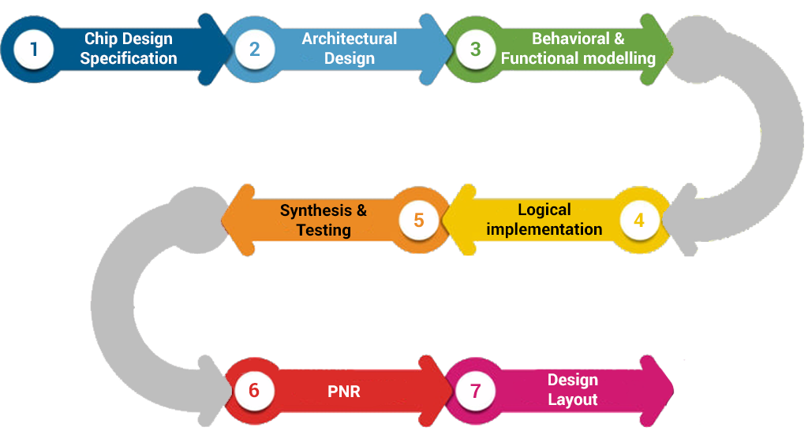

# Chip Design Life Cycle

# Introduction



# Software vs Hardware development

- **Team** costs are similar, but **production** costs are not!
- Unlike software, released hardware products are (mostly) definite: going back from packaging to specification is **very** expensive.

# Specification

- By far the most important step of the cycle.
- If the specification is wrong, the project is bound to failure.
- Specification is manifold, and each aims at a different target audience.
    - Functional specification (FSpec)
    - Technical specification (TechSpec)
    - Test Specification (TSpect)
- **There is no ground truth:** any document can be specification.

# Architecture

- Based on how, when and why the product is going to be used.
- Implements an Instruction Set Architecture (ISA) and/or heterogeneous systems (SoC).

# HDL Coding

- Use a **H**ardware **D**escription **L**anguage (HDL) to portray circuit features.
- HDL examples: VHDL, Verilog.

```verilog
module halfadder(a, b, c, cout);
	input wire a, b;
	output wire c, cout;
	
	assign c = a ^ b;
	assign cout = a & b;
endmodule
```

- Recent trends: **H**igh **L**evel **S**ynthesis (HLS) languages: Chisel, SpinalHDL.

# Abstraction Levels

## Behavioral

- Highest abstraction level when defining circuit behavior.
- Less detail: easier design start and faster simulation time.

```verilog
// This is equivalent to the previous snippet

module adder (a, b, c);
		input wire [1:0] a, b;
		output wire [2:0] c;
		
		assign c = a + b;
endmodule
```

## Gate level

- Lower abstraction level, as it specifies some operation using only logical gates.

```verilog
module adder (a, b, c);
    input wire [1:0] a, b;
    output wire [2:0] c;

    wire carry0, carry1; // Internal carry wires

    // Sum for the least significant bit (LSB)
    assign c[0] = a[0] ^ b[0];
    assign carry0 = a[0] & b[0];

    // Sum for the next bit
    assign c[1] = a[1] ^ b[1] ^ carry0;
    assign carry1 = (a[1] & b[1]) | (carry0 & (a[1] ^ b[1]));

    // Carry out (MSB of the result)
    assign c[2] = carry1;

endmodule
```

# Verification

- Compares circuit operation versus specification.
- Most resources in a project are spent during verification!

### Formal Analysis vs Simulation

- Formal Analysis:
    - No test bench required.
    - Exhaustive: uncovers all possible bugs and reaches maximum depth.
    - Undetermined: possible inconclusive results if there was not enough time to reach all the possible states.
- Simulation:
    - Follows specific paths and might not hit a bug.
    - Depends on test bench quality.
    - Limited controllability: difficult to hit all states.

# Synthesis

- Basically, turn everything done so far into a net list.
- Behavior is translated to logic gates.
- Optimizations are made iteratively.
- Analogous to software compilation.

# Placement and Routing

- Deals with the **physical** architecture of the chip.
- It maps each internal component to some region of the chip, and computes the connections between.

# Fabrication

- Well, self-explanatory.

# Packaging and testing

- Package the circuit into a “chip”, to be tested by some specific machinery.