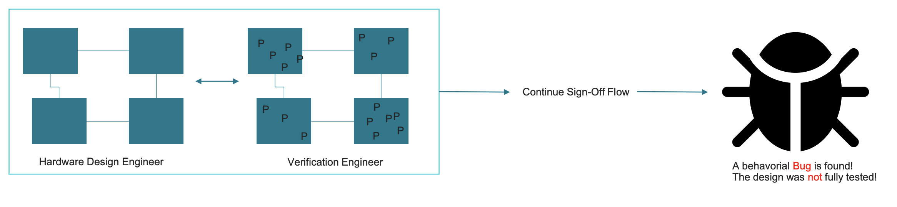

# Introduction to Functional Verification

# What is Functional Verification?

- Step in the EDA process to ensure logic conforms to the specification.
- Hardware bugs are notoriously expensive to fix, as opposed to software.
- Companies pour millions of dollars into this step. Number of verification engineers is 2 to 1 compared to hardware engineers.

# Functional Verification Methods

There are three main approaches for Functional Verification.

## Simulation (dynamic)

Predominant verification method.

- Only option for behavioral-level verification.
- Involves developing testbenches and input vectors.
- Harder to determine whether or not a verification suite completely checks all corner cases or not

**You can simulate separate logical structures that make up a functional unit by performing logic simulation before the functional unit is built.**

## Formal (static)

This derives from **formal logic.**

- Reasoning based on manipulation of formulas, hence static
- The name *formal* can mean many things, e.g., any of the following:
    - Logic equivalency checking (LEC)
    - Model Checking – Functional formal verification (Formal Analysis)
    - Theorem proving

**Uses mathematical expressions to check the logic design.**

## Emulation

- A design is compiled for different modes, namely In-Circuit Emulation (ICE) and Simulation Acceleration (SA), according to the requirements.
- After compilation, the compile result is imported into the run-time interface to run and debug the design on the selected emulator system.
    - Execute and debug RTL and software on custom processor hardware 1000’s times faster than software simulator

**Build a version of your logic design using an FPGA or other programmable logic devices.**

# Coverage

Without coverage, functional verification is an open-loop process:

With coverage, on the other hand, it is possible to know **where** to improve!

WhileIt indicates how thoroughly your entire verification suite exercises the source code, it **DOES NOT provide an indication about correctness of the verification suite**.